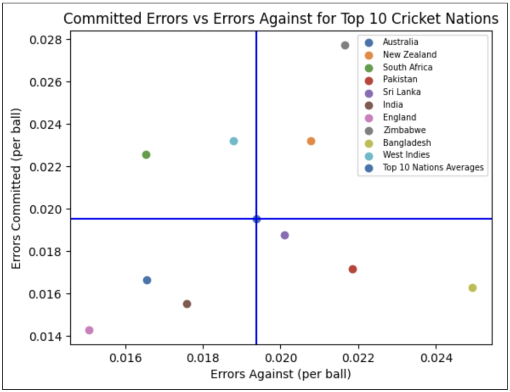
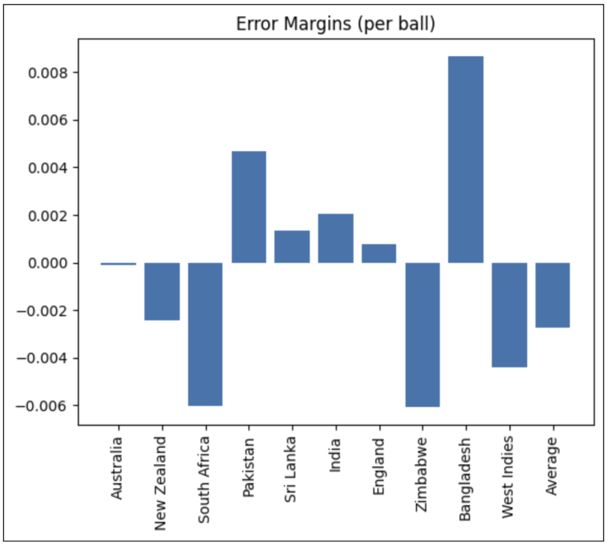
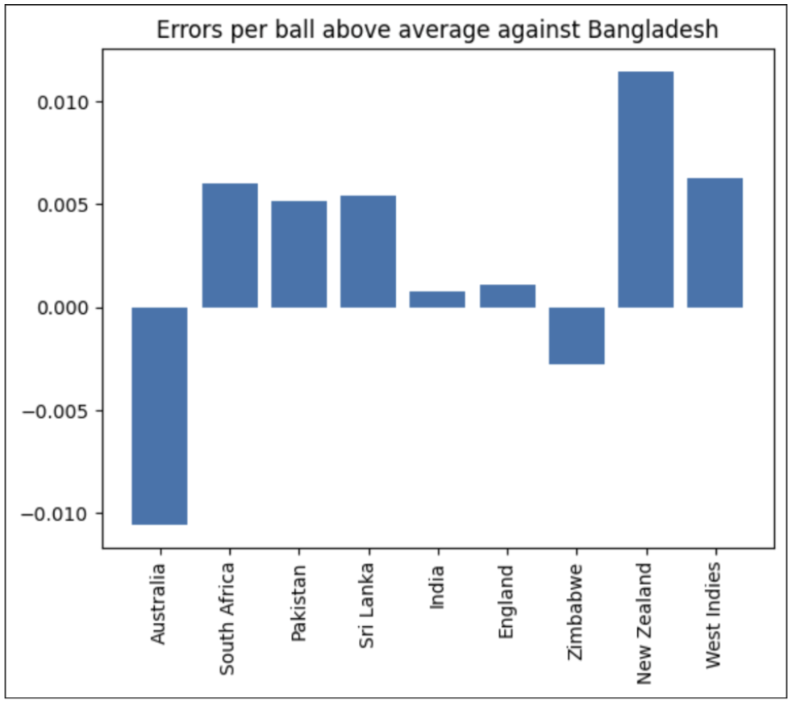

# 🏏 Cricket Error Analysis in Python

---

## 🎯 Goal

To determine whether the coach of a hypothetical cricket team should focus on **reducing their own team’s errors** or **strategically causing more errors from opponents**, based on patterns in "wides" and "no balls".

---

## 🧠 Hypothesis

Certain teams may either **consistently commit more errors** themselves or **cause more errors in their opponents**, suggesting that **error patterns may not be random** and could be strategically exploited.

---

## 📊 Data

- Python-based analysis of match-level cricket data  
- Error types focused on: **wides** and **no balls**  
- Team-level statistics paired with opponent identity to find patterns and trends  
- Full methodology available in the **Presentation** tab of the repository

&nbsp;

---

## 🧪 Methods

- Cleaned and preprocessed team-level match data  
- Investigated team-specific error behavior while **controlling for the opponent**  
- Analyzed whether some teams consistently **induced more errors** from their opponents  
- Explored whether **maximizing the opponent’s margin for error** (within legal bounds) could lead to improved performance

&nbsp;

---

## 🏁 Outcome

Discovered evidence that some teams cause or commit errors at **non-random rates**, opening the door for **coaches to develop more strategic approaches** — either by reducing their own errors through practice or manipulating game conditions to increase their opponents’ error rate. Specifically, there was a seemingly higher error rate for all teams playing against Bangladesh except for Australia, although significance tests were not conducted. 

&nbsp;

---
